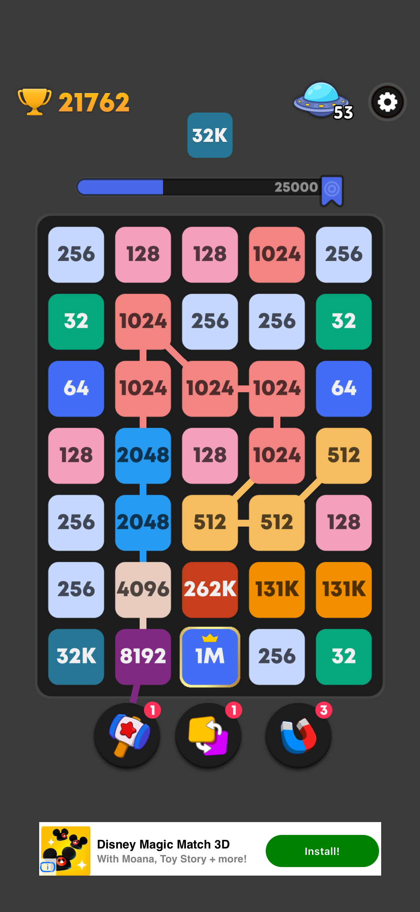

# Merge Mania 🎮

A mobile-first puzzle game where you connect matching numbers to create bigger values. Built with React, TypeScript, and lots of satisfying animations.



## 🎯 Features

- **Progressive Difficulty**: Three modes (Kids, Normal, Hard) with different grid sizes
- **Power-Ups**: Strategic tools to help you out of tough spots
  - Remove: Delete a single block
  - Swap: Exchange positions of two blocks
  - Merge All: Combine all blocks of the same value
- **Number Elimination**: Reach milestones to clear lower numbers from the board
- **Progress System**: Earn rewards as you play and level up
- **Persistent State**: Game saves automatically, resume anytime
- **Mobile-Optimized**: Smooth touch gestures and responsive design

## 🚀 Quick Start

### Prerequisites
- Node.js 18+ and npm
- Modern browser (Chrome, Safari, Firefox)

### Installation

```bash
# Clone the repo
git clone https://github.com/zach-partyka/merge-mania.git
cd merge-mania

# Install dependencies
npm install

# Start development server
npm run dev
```

Open your browser to `http://localhost:5000` (or the port shown in terminal).

### Building for Production

```bash
npm run build
npm start
```

## 🎮 How to Play

1. **Connect Numbers**: Swipe across matching numbers (horizontally, vertically, or diagonally)
2. **Merge Up**: After connecting 2+ of the same number, you can chain to the next power of 2
   - Example: `2 → 2 → 4 → 8` creates a `16`
3. **Earn Progress**: Each merge earns points toward your next power-up reward
4. **Strategy Matters**: Plan ahead! Game ends when no valid moves remain

## 🏗️ Tech Stack

- **Frontend**: React 18, TypeScript, Vite
- **UI Components**: Radix UI (via shadcn/ui)
- **Animations**: GSAP, Framer Motion
- **Styling**: Tailwind CSS
- **State Management**: Custom React hooks
- **Backend**: Express.js (optional server for future features)
- **Database**: PostgreSQL + Drizzle ORM (optional)

## 📂 Project Structure

```
merge-mania/
├── client/
│   ├── src/
│   │   ├── components/     # UI components
│   │   ├── hooks/          # Custom React hooks
│   │   ├── lib/            # Utilities
│   │   └── pages/          # Route pages
│   └── public/             # Static assets
├── server/                 # Express backend (optional)
├── shared/                 # Shared game logic
│   ├── schema.ts           # Game types & constants
│   └── gameLogic.ts        # Pure game functions
└── script/                 # Build scripts
```

## 🎨 Design Philosophy

See [design_guidelines.md](./design_guidelines.md) for:
- Visual hierarchy and layout system
- Typography and color palette
- Component specifications
- Animation principles

## 🧪 Testing

```bash
# Type checking
npm run check

# Run tests (when implemented)
npm test
```

## 📝 Game Rules

### Chain Building
- Connect 2+ blocks of the same value to merge them
- After 2+ base blocks, you can chain to double values
- Valid chain: `2 → 2 → 4 → 8` (merges to `16`)
- Invalid chain: `2 → 4` (need 2+ base blocks first)

### Number Elimination
Reaching certain milestones clears lower numbers:
- **131K**: Eliminates all 2s
- **262K**: Eliminates all 4s
- **524K**: Eliminates all 8s
- **1M**: Eliminates all 16s

### Scoring
- Points = sum of merged block values × difficulty multiplier
- Progress bar fills to unlock power-up rewards
- Track your personal best across sessions

## 🐛 Known Issues

See [PRODUCTION_CHECKLIST.md](./PRODUCTION_CHECKLIST.md) for:
- Planned improvements
- Testing recommendations
- Performance optimizations

## 🤝 Contributing

Contributions welcome! Please:
1. Fork the repo
2. Create a feature branch (`git checkout -b feature/amazing-feature`)
3. Commit your changes (`git commit -m 'Add amazing feature'`)
4. Push to the branch (`git push origin feature/amazing-feature`)
5. Open a Pull Request

## 📄 License

MIT License - see [LICENSE](./LICENSE) file for details

## 🙏 Acknowledgments

- Inspired by 2048, Threes, and Drop7
- UI components from [shadcn/ui](https://ui.shadcn.com/)
- Color palette based on Apollo design system

## 📱 Browser Support

- iOS Safari 14+
- Chrome/Edge 90+
- Firefox 88+
- Samsung Internet 15+

**Note**: Designed for mobile touchscreens. Desktop support is limited to testing purposes.

---

Built with ❤️ for puzzle game enthusiasts
